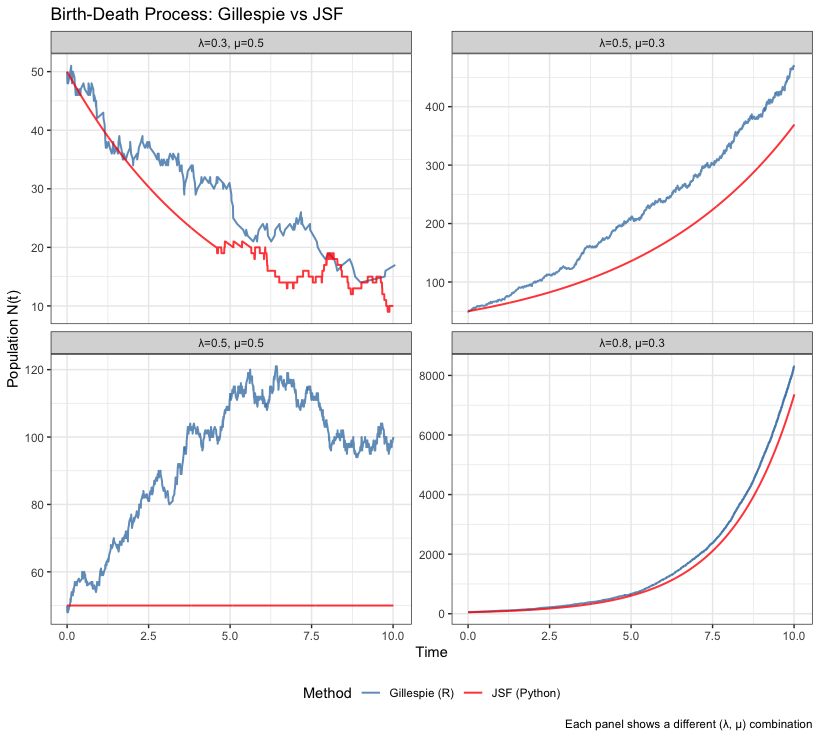

```{r include=FALSE}
knitr::opts_chunk$set(echo = TRUE)
Sys.setenv(RETICULATE_PYTHON = "/Users/olivervu25/micromamba/bin/python3")
source("/Users/olivervu25/Documents/jsf/medium-hard-tests/rjsf/R/sir_reticulate.R")
source("/Users/olivervu25/Documents/jsf/medium-hard-tests/rjsf/R/plot_sir.R")
source("/Users/olivervu25/Documents/jsf/medium-hard-tests/rjsf/R/birthdeath.R")
source("/Users/olivervu25/Documents/jsf/medium-hard-tests/rjsf/R/plot_birthdeadth.R")
library(ggplot2)
library(tidyr)
library(reticulate)
```

## Medium Test: SIR Epidemic Model via JSF

**Code:** `R/sir_reticulate.R`, `R/plot_sir.R`

This test creates a basic R package that calls the Python `jsf` package via 
`reticulate`. The SIR epidemic model is simulated where only the infectious 
compartment `I` uses exact stochastic simulation (`DoDisc = 1`), while `S` 
and `R` run as ODEs — since they are large populations where stochastic 
effects are negligible.

```{r sir}
result <- jsf_sir(N = 1000, I0 = 10, beta = 0.5, gamma = 0.1, t_max = 60)
plot_sir(result)
```

---

## Hard Test: Birth-Death Process — Gillespie (R) vs JSF (Python)

**Code:** `R/birthdeath.R`, `R/plot_birthdeath.R`, `data-raw/pre_compute_jsf.py`

The birth-death process is simulated under four (λ, μ) combinations using 
two methods:

- **Gillespie (R):** exact stochastic simulation implemented from scratch in R
- **JSF (Python):** pre-computed using the Python `jsf` package and loaded as a CSV



**Key observations:**

- **λ=0.3, μ=0.5** (death dominates): both methods show population decline, 
  but JSF transitions to a smooth ODE once population is large, while Gillespie 
  remains discrete and noisy throughout
- **λ=0.5, μ=0.3** (birth dominates): both track closely at large N — JSF 
  correctly switches to ODE regime as population grows
- **λ=0.5, μ=0.5** (neutral): Gillespie drifts due to randomness while JSF 
  stays near the mean-field expectation (N ≈ 50), illustrating the difference 
  between a single stochastic realisation and the deterministic mean
- **λ=0.8, μ=0.3** (fast growth): both methods agree closely since population 
  quickly becomes large, reducing stochastic effects